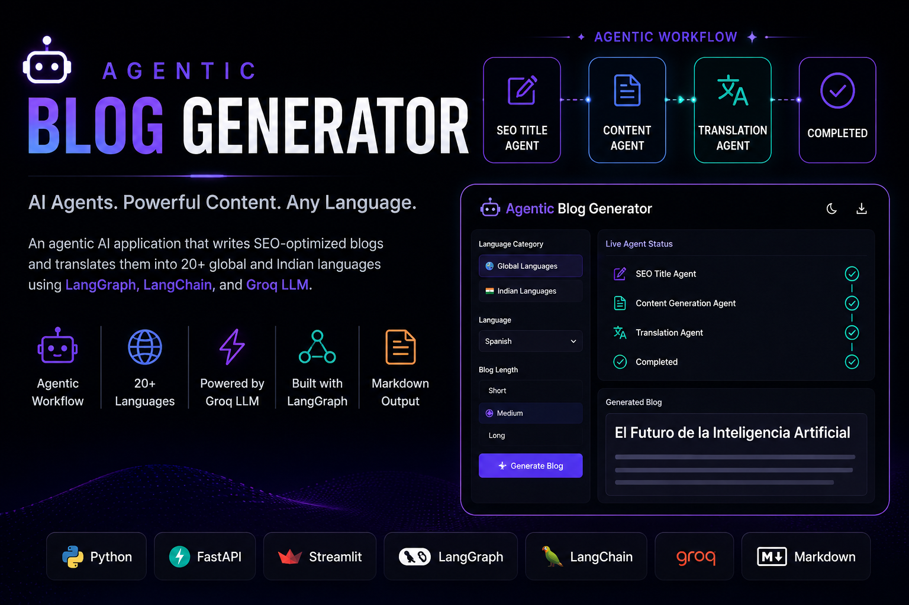
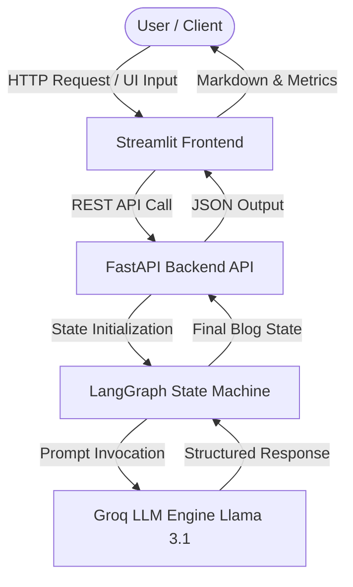
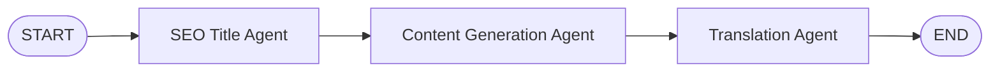

<p align="center">
  
</p>

# Agentic Blog Generator

> Autonomous, multi-agent AI system for generating SEO-optimized, long-form Markdown blogs with dynamic multi-language translation.

---

## Table of Contents

- [Introduction](#introduction)
- [Features](#features)
- [Architecture](#architecture)
- [Agent Workflow](#agent-workflow)
- [Technology Stack](#technology-stack)
- [Project Structure](#project-structure)
- [Installation](#installation)
- [Environment Variables](#environment-variables)
- [Usage](#usage)
- [API Documentation](#api-documentation)
- [Configuration](#configuration)
- [Future Improvements](#future-improvements)
- [Contributing](#contributing)
- [License](#license)
- [Author](#author)

---

## Introduction

**Agentic Blog Generator** is an enterprise-ready AI platform designed to automate the process of technical and creative content creation. Powered by **LangGraph**, **LangChain**, and **Groq Llama 3.1**, the system coordinates specialized AI agents into a deterministic state-machine workflow.

### The Problem
Traditional single-prompt LLM generation often leads to unstructured content, generic headlines, lack of depth, and rigid language constraints. Manual editorial processes (SEO title research, detailed drafting, and multi-language translation) are time-consuming and fragmented.

### Why Agentic AI?
By decomposing blog creation into a sequence of discrete, specialized agents:
- **SEO Title Agent**: Focuses strictly on creating high-converting, search-engine-optimized titles.
- **Content Generation Agent**: Generates structured, long-form Markdown content with custom depth settings.
- **Translation Agent**: Dynamically translates both title and content into target languages while preserving formatting, technical terminology, and tone.

This modular state-machine pattern ensures predictable outputs, transparent step tracing, and robust error recovery.

---

## Features

- **SEO Title Generation**: Formulates high-performing, creative title options for specified topics.
- **Structured Long-Form Content**: Generates structured Markdown blogs complete with subheadings, tables, bullet points, and code snippets.
- **Dynamic Multi-Language Translation**: Single-node dynamic translation supporting global and regional Indian languages without graph mutation.
- **Categorized Language Selection**: Supports 10 Global Languages (English, Spanish, French, German, etc.) and 10 Indian Languages (Hindi, Marathi, Gujarati, Tamil, etc.).
- **Depth & Length Control**: Configurable blog depth options (`Short`: 300–500 words, `Medium`: 800–1200 words, `Long`: 1500+ words).
- **LangGraph Agent Workflow**: Deterministic graph-based state management compiled via `StateGraph`.
- **FastAPI REST Server**: Production-grade async HTTP API endpoint (`POST /blogs`).
- **Streamlit SaaS Frontend**: High-contrast, black-and-white minimalist user interface with live step tracking.
- **LangSmith Tracing Integration**: Full observability into agent prompt execution, tokens, and response latencies.
- **Modular Project Architecture**: Strict separation of concerns across state definitions, graph nodes, API services, and UI components.

---

## Architecture

The system uses a decoupled client-service-agent architecture:



---

## Agent Workflow

The LangGraph engine executes a linear state machine sequence:



1. **Title Agent (`title_creation`)**: Takes user topic and returns an SEO-friendly blog title.
2. **Content Agent (`content_generation`)**: Reads topic, title, and length setting to generate structured Markdown content.
3. **Translation Agent (`translation`)**: Inspects `current_language`. If target language is non-English, dynamically translates title and body while preserving Markdown structure.

---

## Technology Stack

<p align="center">
  
  
  
  
  
  
  
  
  
</p>

| Component | Technology | Description |
| :--- | :--- | :--- |
| **Language** | `Python 3.10+` | Primary programming language runtime. |
| **Orchestration** | `LangGraph` | Stateful multi-agent graph compilation and execution. |
| **LLM Framework** | `LangChain` / `langchain-groq` | Prompt templates, message schemas, and provider integration. |
| **LLM Inference** | `Groq Llama 3.1` | Ultra-low latency LLM inference engine. |
| **Web Server** | `FastAPI` & `Uvicorn` | Asynchronous REST backend hosting `/blogs` API endpoint. |
| **User Interface** | `Streamlit` | Modern, responsive web frontend with custom CSS styling. |
| **Data Validation** | `Pydantic` / `TypedDict` | Schema enforcement for blog state and request bodies. |
| **Observability** | `LangSmith` | Distributed tracing for agent steps, latency, and tokens. |
| **Package Manager** | `uv` / `pip` | Next-generation Python package management. |

---

## Project Structure

```
Agentic-Blog-Generator/
├── assets/
│   └── banner.png                # Repository banner image
├── components/
│   ├── actions.py                # Export controls (Copy, Download MD, Download PDF)
│   ├── blog_display.py           # Markdown & statistics rendering components
│   ├── header.py                 # Application header & branding
│   ├── sidebar.py                # Language category & depth selection settings
│   └── status.py                 # Live agent step progress indicators
├── config/
│   └── constants.py              # Centralized configuration & default settings
├── services/
│   └── api_service.py            # Graph invocation and backend service wrapper
├── src/
│   └── agentic_blog_generator/
│       ├── graphs/
│       │   └── graphBuilder.py   # StateGraph compilation & edge setup
│       ├── llms/
│       │   └── groqllm.py        # Groq Chat model setup
│       ├── nodes/
│       │   └── blogNode.py       # Agent node logic (Title, Content, Translation)
│       └── states/
│           └── blogState.py      # TypedDict state & Pydantic blog schemas
├── utils/
│   ├── helpers.py                # Statistics calculator & PDF export utility
│   ├── languages.py              # Global and Indian language mappings
│   └── styles.py                 # Custom minimalist Black & White CSS
├── app.py                        # FastAPI server entry point
├── langgraph.json                # LangGraph CLI & Studio configuration
├── pyproject.toml                # Project metadata & dependencies
├── requirements.txt              # Exported pip dependencies
├── streamlit_app.py              # Streamlit application entry point
└── README.md                     # Project documentation
```

---

## Installation

### Prerequisites
- Python `3.10+`
- `uv` package manager (recommended) or `pip`
- A valid Groq API Key

### Step 1: Clone Repository
```bash
git clone https://github.com/vickyraut/Agentic-Blog-Generator.git
cd Agentic-Blog-Generator
```

### Step 2: Environment Setup
Using `uv`:
```bash
uv venv
source .venv/bin/activate  # On Windows: .venv\Scripts\activate
uv sync
```

Or using standard `pip`:
```bash
python -m venv .venv
source .venv/bin/activate  # On Windows: .venv\Scripts\activate
pip install -r requirements.txt
```

---

## Environment Variables

Create a `.env` file in the root directory:

```ini
# Required: Groq LLM API Key
GROQ_API_KEY=your_groq_api_key_here

# Optional: LangSmith Tracing
LANGCHAIN_TRACING_V2=true
LANGCHAIN_API_KEY=your_langchain_api_key_here
LANGCHAIN_PROJECT=agentic-blog-generator
```

| Variable | Required | Description |
| :--- | :--- | :--- |
| `GROQ_API_KEY` | **Yes** | API key obtained from [Groq Console](https://console.groq.com/). |
| `LANGCHAIN_TRACING_V2` | Optional | Enables LangSmith distributed tracing. |
| `LANGCHAIN_API_KEY` | Optional | API key for LangSmith project tracking. |
| `LANGCHAIN_PROJECT` | Optional | Target project name in LangSmith. |

---

## Usage

### 1. Running the Streamlit App
Launch the interactive web UI:
```bash
uv run streamlit run streamlit_app.py
```
Access the dashboard at `http://localhost:8501`.

### 2. Running the FastAPI Backend Server
Start the asynchronous REST API server:
```bash
uv run python app.py
```
The server will start at `http://localhost:8000`. Access interactive API documentation at `http://localhost:8000/docs`.

---

## API Documentation

### `POST /blogs`

Generates a complete blog post based on specified parameters.

#### Request Headers
```http
Content-Type: application/json
```

#### Request Body Example
```json
{
  "topic": "The Impact of Artificial Intelligence on Modern Software Engineering",
  "language": "Hindi",
  "blog_length": "Medium"
}
```

#### Response Example (`200 OK`)
```json
{
  "data": {
    "topic": "The Impact of Artificial Intelligence on Modern Software Engineering",
    "current_language": "Hindi",
    "blog_length": "Medium",
    "blog": {
      "title": "आधुनिक सॉफ्टवेयर इंजीनियरिंग पर आर्टिफिशियल इंटेलिजेंस का प्रभाव",
      "content": "# आधुनिक सॉफ्टवेयर इंजीनियरिंग पर आर्टिफिशियल इंटेलिजेंस का प्रभाव\n\nआर्टिफिशियल इंटेलिजेंस (AI) ने हाल के वर्षों में सॉफ्टवेयर विकास के क्षेत्र में एक नई क्रांति ला दी है...\n"
    }
  }
}
```

---

## Configuration

### Configurable Parameters

1. **Target Language**: Selectable via UI sidebar (Global & Indian language lists).
2. **Blog Depth**:
   - `Short`: 300 – 500 words.
   - `Medium`: 800 – 1200 words.
   - `Long`: 1500+ words.
3. **LLM Engine**: Configurable model parameter in `src/agentic_blog_generator/llms/groqllm.py` (Default: `llama-3.1-8b-instant`).

---

## Contributing

Contributions are welcome! Please follow these steps:

1. Fork the Repository.
2. Create a Feature Branch (`git checkout -b feature/AmazingFeature`).
3. Commit your Changes (`git commit -m 'Add some AmazingFeature'`).
4. Push to the Branch (`git push origin feature/AmazingFeature`).
5. Open a Pull Request.

Please ensure your code adheres to PEP 8 standards and includes relevant test cases.

---

## License

This project is licensed under the **MIT License** - see the [LICENSE](LICENSE) file for details.

---

## Author

<p align="center">
  <strong>Vicky V. Raut</strong><br>
  <em>AI & Software Engineer</em>
</p>

<p align="center">
  <a href="https://vickyraut.vercel.app/"></a>
  <a href="https://github.com/vickyraut"></a>
  <a href="https://www.linkedin.com/in/vickyraut/"></a>
  <a href="mailto:vraut12cr@gmail.com"></a>
</p>

<br>

---

<p align="center">
  <em>If you found this project helpful, consider giving it a ⭐ on GitHub. Your support is appreciated!</em>
</p>

<p align="center">
  Made with ❤️ by <strong>Vicky V. Raut (CodeMonk)</strong>
</p>

